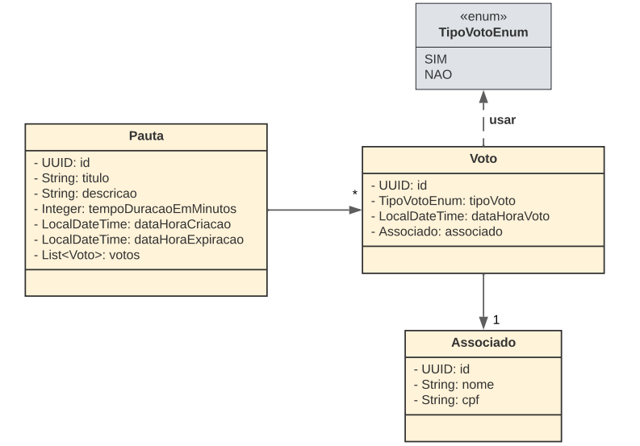
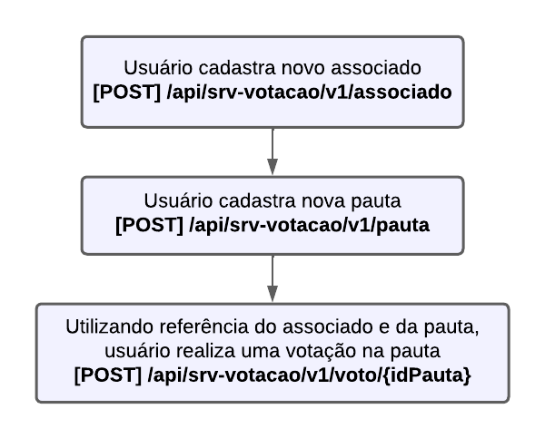

# 🙋🏼 API de pautas e votações

>Este projeto se trata um sistema de cadastro de pautas e votações desenvolvido em Java com Spring Boot. Ele utiliza uma arquitetura
RESTful para implementar suas regras de negócio

## Tópicos

- [📖 Histórias de usuário](#histórias-de-usuário)
- [📋 Pré-requisitos](#pré-requisitos)
- [✨ Variáveis de ambiente](#variáveis-de-ambiente)
- [📜 UML](#uml)
- [↪ Fluxo](#fluxo)
- [🚀 Funcionalidades](#funcionalidades)
- [📃 Swagger](#swagger)
- [💻 Tecnologias utilizadas](#tecnologias-utilizadas)
- [⌛ Funcionalidades futuras](#Implementações-futuras)
- [▶ Execução local](#Execução-local)
- [👨🏼‍💻 Desenvolvedor](#desenvolvedor)

## Histórias de usuário

Para desenvolver o projeto, o primeiro passo foi realizar a escrita de histórias do usuário. Detalhando, assim, 
todas as funcionalidades que deveriam ser desenvolvidas para garantir uma boa documentação do código e progresso 
organizado do fluxo de desenvolvimento
 
> [História 1 - Criação de novo associado](https://github.com/LagrotaGabriel/votacao-cooperativismo/blob/main/src/main/resources/docs/historias/HISTORIA-1-CRIACAO_NOVO_ASSOCIADO.pdf)
 
> [História 2 - Criação de nova pauta](https://github.com/LagrotaGabriel/votacao-cooperativismo/blob/main/src/main/resources/docs/historias/HISTORIA-2-CRIACAO_NOVA_PAUTA.pdf)
 
> [História 3 - Registro de voto](https://github.com/LagrotaGabriel/votacao-cooperativismo/blob/main/src/main/resources/docs/historias/HISTORIA-3-REGISTRAR_VOTO.pdf)
 
> [História 4 - Obter pautas paginadas](https://github.com/LagrotaGabriel/votacao-cooperativismo/blob/main/src/main/resources/docs/historias/HISTORIA-4-OBTER_PAUTAS.pdf)

> [História 5 - Obter pautas por id](https://github.com/LagrotaGabriel/votacao-cooperativismo/blob/main/src/main/resources/docs/historias/HISTORIA-5-OBTER_PAUTA_POR_ID.pdf)

## Pré-requisitos

Antes de começar, verifique se você atendeu aos seguintes requisitos:

- Você possui o `PostgreSQL` instalado em sua máquina
- Você possui o `Java 17` instalado em sua máquina.
- A porta `8070` não está sendo utilizada
- Você criou um schema no PostgreSQL para a aplicação
- Você configurou as [Variáveis de ambiente](#variáveis-de-ambiente) adequadamente em sua IDE

## Variáveis de ambiente

| Chave         | Exemplo                             | Descrição                                   |
|---------------|-------------------------------------|---------------------------------------------|
| DB_URL        | postgresql://localhost:5432/votacao | URL do banco de dados                       |
| DB_USERNAME   | postgres                            | Nome de usuário de acesso ao banco de dados |
| DB_PASSWORD   | 123                                 | Senha de acesso ao banco de dados           |

## UML

> Na UML abaixo, podemos ver como está disposto o mapeamento de entidades da aplicação

## Fluxo

> O fluxo da aplicação se trata basicamente do caminho que o usuário deverá trilhar para usufruir das 
> funcionalidades da API

1. O usuário deve cadastrar um associado;
2. O usuário deve cadastrar uma pauta;
3. Utilizando a referência do associado e da pauta, o usuário pode realizar uma votação;

> Para visualização das regras de negócio dos processos do fluxo, indicado a leitura das 
> [Histórias de usuário](#histórias-de-usuário)

## Funcionalidades

:heavy_check_mark: `Cadastro de Associado:` A API possibilita o cadastro de Associados;

:heavy_check_mark: `Cadastro de Pauta:` A API possibilita o cadastro de Pautas;

:heavy_check_mark: `Cadastro de Votos:` A API possibilita o cadastro de votos utilizando os dados de pautas e
associados previamente cadastrados;

:heavy_check_mark: `Obtenção paginada de pautas:` A API possibilita a obtenção paginada de pautas.

:heavy_check_mark: `Obtenção de pautas por id:` A API possibilita a obtenção de pautas por id.

## Swagger

> Para acessar o swagger basta acessar o endpoint `/documentacao-api` e navegar entre os tópicos Associados, CPF's, 
> Pautas e votações

## Tecnologias Utilizadas

- Java 17
- Spring Boot 3.2.11
- Swagger
- JPA
- PostgreSQL (Dev, Prod)
- H2 (Test)
- Postman
- Lombok
- J Unit
- Intellij
- Feign

## Implementações futuras

Futuramente a aplicação deverá possuir as seguintes implementações:
- Melhorias de coberturas de testes
- Cache
- Resiliência
- Preparar pipeline para deploy em cloud

## Execução local

1. Para clonar o projeto basta utilizar o git clone com a url: https://github.com/LagrotaGabriel/votacao-cooperativismo.git

2. A porta padrão da aplicação está definida em 8070. Então as requisições deverão apontar para essa porta  

3. Cada módulo de aplicação `Associados, Pautas, Votações e CPF` possui um diretório "docs". Neste diretório está disponível a
   collection do postman de cada um dos módulos da aplicação. As collections já possuem requisições de sucesso e de erro
   de exemplo  

4. Extremamente necessário que os [pré-requisitos](#pré-requisitos) sejam atendidos

## Desenvolvedor

[ Gabriel Lagrota](https://github.com/LagrotaGabriel)